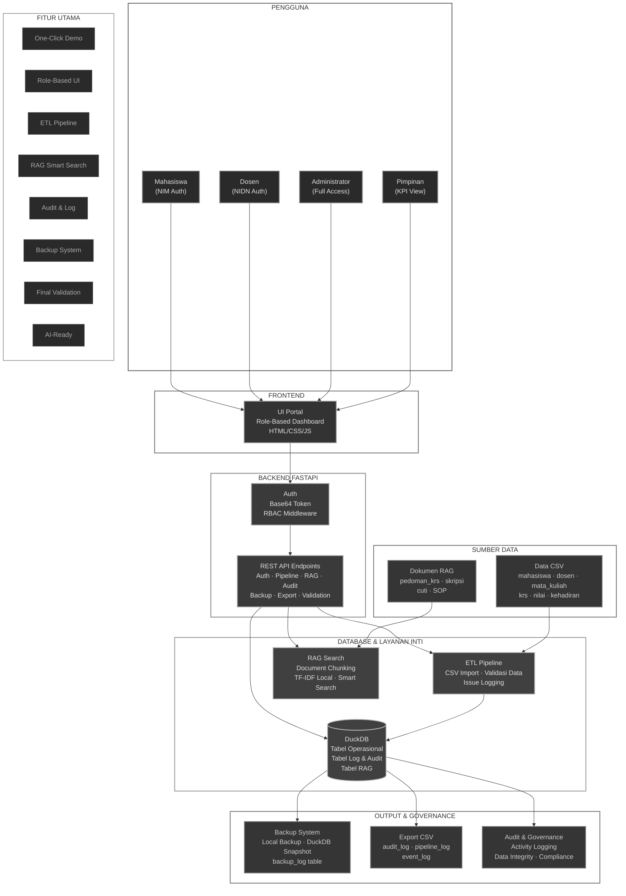
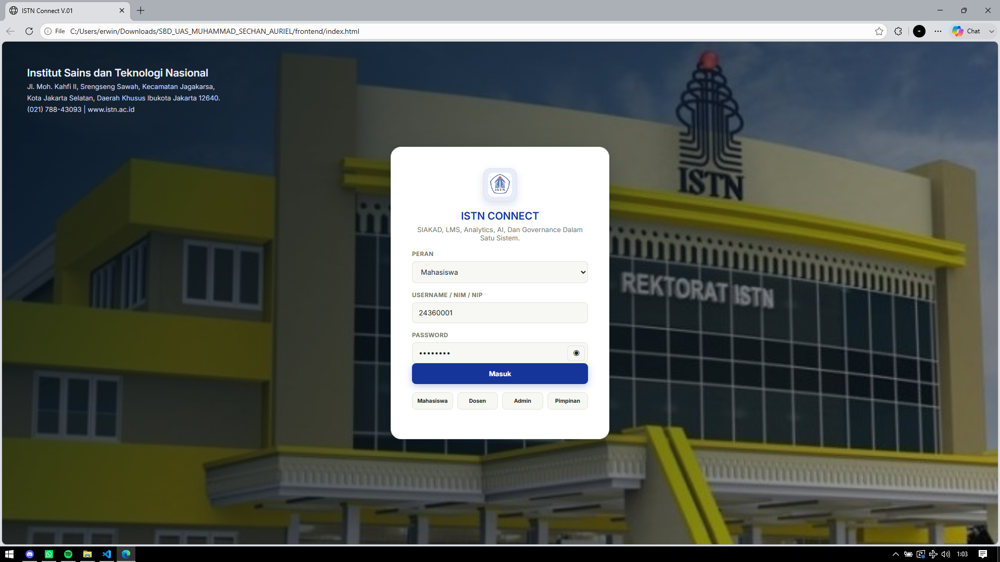
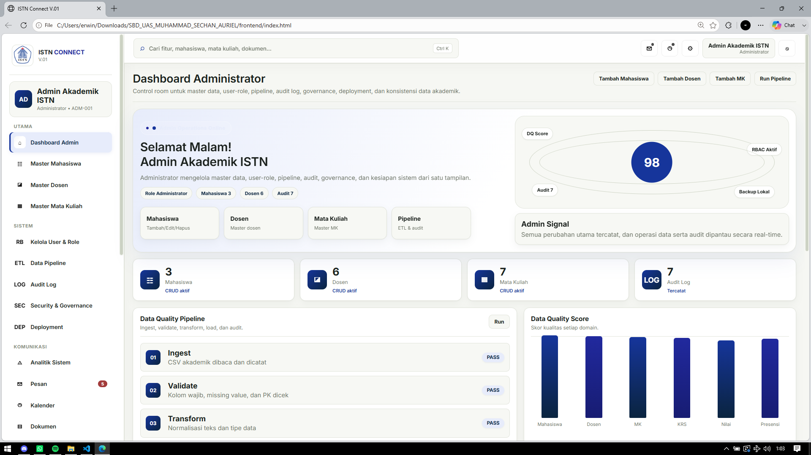
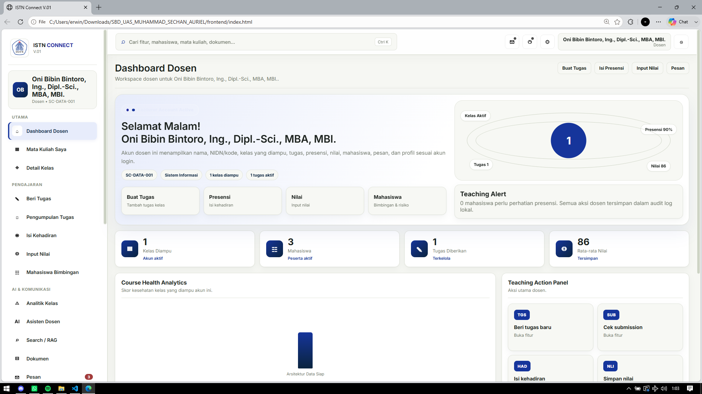
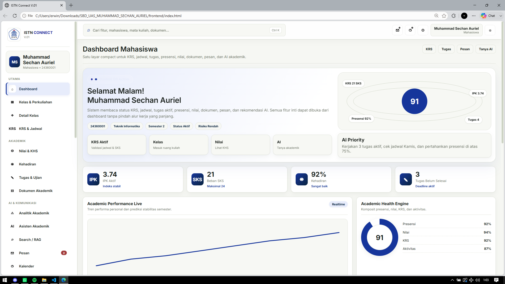
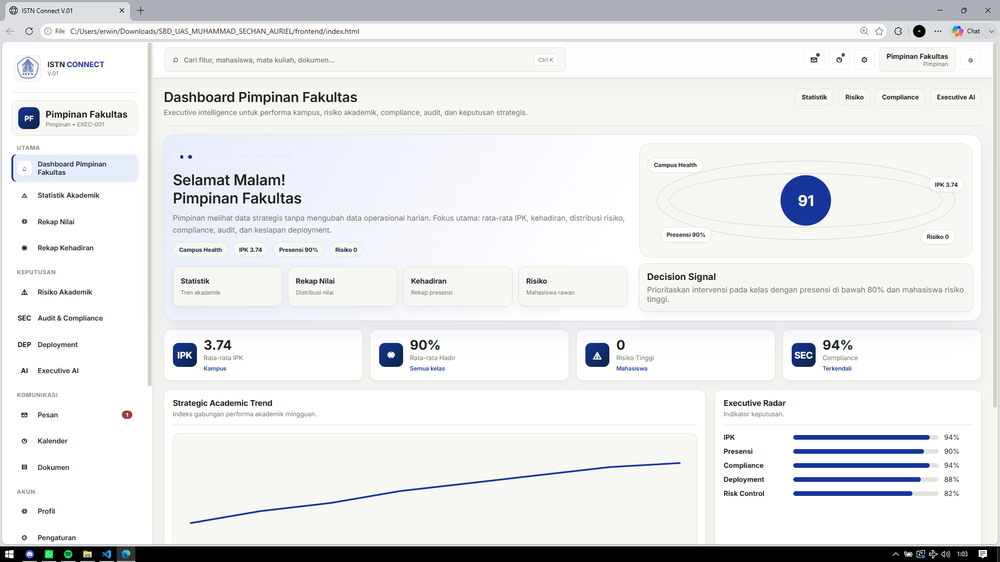

# ISTN CONNECT SC-DATA

> Prototipe portal akademik terpadu dengan UI role-based, backend FastAPI, database DuckDB, pipeline CSV, pencarian dokumen RAG, audit log, backup, dan final validation.

---

## Ringkasan

**ISTN CONNECT SC-DATA** adalah sistem akademik lokal yang berjalan sepenuhnya tanpa ketergantungan layanan eksternal. Sistem ini dirancang sebagai bukti konsep (POC) yang stabil untuk lingkungan offline, dengan fokus pada kualitas data, auditabilitas, dan kesiapan integrasi AI.

Dengan satu klik (`START_ONE_CLICK.bat`), sistem akan:
- Menyiapkan virtual environment Python lokal
- Menginstal dependency backend
- Membuat dan memeriksa skema DuckDB
- Menyiapkan data sample dan dokumen RAG
- Menjalankan backend FastAPI
- Membuka UI frontend dan halaman bukti demo

---

## Diagram Arsitektur

Diagram arsitektur sistem tersedia :

### Penjelasan per Layer

#### 1. Layer Pengguna (User Layer)
Empat role utama mengakses portal yang sama dengan hak akses berbeda:
- **Mahasiswa** — autentikasi via NIM, mengakses KRS, jadwal, nilai, presensi, dan AI akademik.
- **Dosen** — autentikasi via NIDN, mengelola kelas, tugas, input nilai/presensi, dan bimbingan.
- **Administrator** — full access ke master data, pipeline ETL, audit log, governance, backup, dan RBAC.
- **Pimpinan** — view-only eksekutif untuk KPI kampus, risiko akademik, compliance, dan insight strategis.

> Semua role masuk melalui satu portal login yang sama. Token autentikasi berformat Base64 `Role:Username` dan RBAC memfilter endpoint serta menu UI sesuai role.

#### 2. Layer Frontend
- **UI Portal** — antarmuka HTML/CSS/JS tunggal yang menyesuaikan menu dan dashboard berdasarkan role pengguna yang login.
- Tidak memerlukan build tool atau framework JS berat; berjalan langsung di browser.
- Komunikasi ke backend via fetch/AJAX ke endpoint FastAPI lokal.

#### 3. Layer Backend (FastAPI)
- **Auth & RBAC Middleware** — memvalidasi token Base64 dan memastikan hanya role yang berwenang bisa mengakses endpoint sensitif (pipeline, backup, RAG build, dll).
- **REST API Endpoints** — mencakup:
  - Autentikasi (`/api/auth/*`)
  - Pipeline ETL (`/api/pipeline/*`)
  - RAG Search (`/api/rag/*`)
  - Audit & Export (`/api/audit/*`, `/api/export/*`)
  - Backup & Validasi (`/api/backup/*`, `/api/validation/*`)
  - Event Monitor (`/api/events/*`)

> Setiap aktivitas penting (login, pipeline run, backup, RAG build) tercatat otomatis ke `audit_log`.

#### 4. Layer Database & Layanan Inti
- **DuckDB** — database lokal analitik yang menyimpan:
  - Tabel operasional: `mahasiswa`, `dosen`, `mata_kuliah`, `krs`, `nilai`, `kehadiran`
  - Tabel log & audit: `event_log`, `pipeline_log`, `pipeline_issue_log`, `audit_log`, `backup_log`
  - Tabel RAG: `document_chunks`
- **ETL Pipeline** — membaca CSV dari `data/csv/`, melakukan validasi (duplikat, nilai kosong, rentang nilai 0-100, normalisasi status kehadiran), lalu memuat baris valid ke DuckDB dan mencatat masalah ke `pipeline_issue_log`.
- **RAG Search** — mem-parsing dokumen akademik di `docs/rag/`, melakukan chunking, menyimpan ke `document_chunks`, dan menerima query pencarian dengan relevansi TF-IDF lokal — tanpa API eksternal.

#### 5. Layer Sumber Data
- **Data CSV** — 6 file sumber: `mahasiswa.csv`, `dosen.csv`, `mata_kuliah.csv`, `krs.csv`, `nilai.csv`, `kehadiran.csv`.
- **Dokumen RAG** — 4 dokumen akademik: `pedoman_krs.txt`, `pedoman_skripsi.txt`, `aturan_cuti_akademik.txt`, `sop_perkuliahan.txt`.

> CSV di-feed ke ETL Pipeline; dokumen RAG di-feed ke RAG Search. Keduanya tidak diubah secara manual setelah sistem berjalan.

#### 6. Layer Output & Governance
- **Backup System** — snapshot DuckDB disimpan ke `backend/backups/` dengan metadata di `backup_log`.
- **Export CSV** — `audit_log`, `pipeline_log`, dan `event_log` bisa diunduh sebagai CSV untuk bukti dan compliance.
- **Audit & Governance** — semua aktivitas tercatat dengan role, action, detail, status, dan metadata. Data integrity dicek via final validation.

#### 7. Fitur Utama (Sidebar)
Ringkasan kemampuan sistem yang tercakup di seluruh layer:
- **One-Click Demo** — `START_ONE_CLICK.bat` menyiapkan environment, database, data sample, dan membuka browser.
- **Role-Based UI** — satu portal, empat tampilan dashboard berbeda.
- **ETL Pipeline** — impor CSV otomatis dengan validasi data.
- **RAG Smart Search** — pencarian dokumen akademik berbasis AI lokal.
- **Audit & Log** — jejak aktivitas lengkap dan tervalidasi.
- **Backup System** — backup lokal DuckDB dengan metadata.
- **Final Validation** — checklist otomatis memastikan semua komponen siap.
- **AI-Ready** — arsitektur siap integrasi model AI lebih lanjut.

---

### Diagram Mermaid



---

## Tujuan Sistem

SC-DATA dirancang sebagai ekosistem kampus yang datanya dapat **dilacak**, **divalidasi**, **diamankan**, dan **AI-Ready**.

---

## Layanan Terpadu

| Role | Akses Utama |
|------|-------------|
| **Mahasiswa** | Dashboard personal, KRS, jadwal, nilai, kehadiran, AI akademik |
| **Dosen** | Kelas yang diampu, pengelolaan tugas, input presensi/nilai, bimbingan, AI teaching assistant |
| **Administrator** | Master data, pipeline ETL, audit log, RBAC, governance, backup, status sistem |
| **Pimpinan** | KPI kampus, rata-rata IPK, kehadiran, risiko akademik, compliance, insight strategis |

Semua peran masuk ke portal yang sama dengan menu dan aksi yang direstriksi sesuai role masing-masing (RBAC).

---

## Fitur Utama

| Fitur | Deskripsi |
|-------|-----------|
| **One Click Demo** | Setup otomatis dengan `START_ONE_CLICK.bat` |
| **Frontend Interaktif** | UI login role-based, dashboard personalisasi, command center |
| **Backend FastAPI** | REST API lokal dengan autentikasi, RBAC, audit, export, backup, dan validasi |
| **Database DuckDB** | Penyimpanan lokal tabel analitik dan log untuk eksekusi cepat |
| **ETL / Data Pipeline** | Impor CSV, validasi, dan pencatatan masalah data |
| **RAG / Smart Search** | Pencarian dokumen akademik berbasis chunking dan TF-IDF lokal |
| **Audit & Governance** | Pencatatan aktivitas, backup lokal, dan ekspor CSV bukti |
| **Role-Based Access** | Antarmuka dan jalur akses berbeda per role |

---

## Keamanan & Governance

- **Autentikasi**: Login menghasilkan token Base64 dengan format `Role:Username`
- **RBAC**: Endpoint sensitif (pipeline, event, RAG, backup) memerlukan role `Administrator`
- **Validasi Input**: Semua input JSON diperiksa oleh Pydantic model
- **Audit Log**: Setiap aktivitas penting tersimpan di tabel `audit_log` dengan role, action, detail, status, dan metadata
- **Data Integrity**: Pipeline memeriksa duplikat, nilai kosong, nilai di luar rentang, dan status kehadiran tidak valid
- **Backup Lokal**: Backup DuckDB tersimpan di `backend/backups/` dengan metadata di tabel `backup_log`
- **Ekspor Bukti**: Log audit, event, dan pipeline dapat diunduh sebagai CSV

---

## Tampilan UI

Berikut cuplikan antarmuka ISTN CONNECT SC-DATA untuk masing-masing peran pengguna:

### Halaman Login

Portal masuk dengan pemilihan peran (Mahasiswa, Dosen, Admin, Pimpinan) dan latar belakang kampus ISTN.



---

### Dashboard Administrator

Control room untuk master data, user-role, pipeline ETL, audit log, governance, deployment, dan konsistensi data akademik. Menampilkan Data Quality Score, status pipeline, dan audit log real-time.



---

### Dashboard Dosen

Workspace dosen lengkap dengan kelas yang diampu, pengelolaan tugas, input presensi/nilai, daftar bimbingan, dan AI teaching assistant. Dilengkapi Course Health Analytics dan Teaching Action Panel.



---

### Dashboard Mahasiswa

Satu layar compact untuk KRS, jadwal, tugas, presensi, nilai, dokumen, pesan, dan AI akademik. Menampilkan Academic Performance Live, Academic Health Engine, dan AI Priority.



---

### Dashboard Pimpinan Fakultas

Executive intelligence untuk performa kampus, risiko akademik, compliance, audit, dan keputusan strategis. Menampilkan Strategic Academic Trend, Executive Radar, dan Decision Signal.



---

## Cara Menjalankan

### One-Click Deployment

1. Ekstrak proyek jika diperlukan
2. Jalankan `START_ONE_CLICK.bat` dari root folder
3. Tunggu proses setup selesai
4. Buka browser ke `http://127.0.0.1:8000` (backend) atau buka `index.html` secara langsung (frontend)

**Apa yang dilakukan `START_ONE_CLICK.bat`?**

`backend/one_click_demo.py` menjalankan otomatisasi berikut:
- Menunggu backend FastAPI aktif
- Login sebagai Administrator untuk mendapat token
- Memuat `kehadiran_event.csv` ke `event_log`
- Menjalankan pipeline 6 CSV ke tabel DuckDB
- Membangun index RAG untuk `document_chunks`
- Membuat backup DuckDB
- Menjalankan final validation
- Membuka browser ke Database Proof, Final Validation, dan portal frontend

### Manual Deployment

```powershell
py -3 -m venv .venv
.\.venv\Scripts\Activate.ps1
python -m pip install -r backend/requirements.txt
python backend/init_db.py
python backend/seed_data.py
python -m uvicorn backend.main:app --reload
```

Kemudian buka `index.html` di browser.

### Deployment Production / On-Premise

- Gunakan production ASGI server seperti `uvicorn` atau `gunicorn` dengan worker Python yang sesuai
- Pastikan folder `backend/backups/` dan `backend/outputs/` aman
- Aktifkan GitHub Pages dengan folder `docs/` atau `docs/project/` untuk dokumentasi terpublikasi

---

## Akun Demo

| Role | Username | Password |
|------|----------|----------|
| Administrator | `admin` | `admin123` |
| Pimpinan | `pimpinan` | `pimpinan123` |
| Mahasiswa | `24360001` | `24360001` |
| Dosen | `oni` | `oni123` |

> **Catatan**: Mahasiswa umumnya menggunakan NIM sebagai username dan password.

---

## Struktur Folder

```
├── index.html                  # UI utama
├── frontend/                   # Aset frontend, CSS, JS, screenshot
├── backend/                    # API, database utils, init, seed, backup
│   ├── main.py                 # Endpoint FastAPI
│   ├── db.py                   # Utilitas database, audit, export
│   ├── init_db.py              # Inisialisasi skema DuckDB
│   ├── seed_data.py            # Data sample CSV, event, dokumen RAG
│   ├── requirements.txt        # Dependency Python
│   └── sc_data.duckdb          # Database lokal
├── data/                       # Data sumber CSV dan JSON
├── docs/                       # Dokumentasi dan dokumen RAG
│   ├── project/                # Dokumentasi arsitektur dan alur
│   ├── images/                 # Gambar pendukung dokumentasi
│   └── rag/                    # Dokumen RAG (KRS, skripsi, cuti, SOP)
├── scripts/                    # Batch file bantu
│   ├── START_ONE_CLICK.bat     # Launcher demo satu klik
│   ├── STOP_BACKEND.bat        # Hentikan backend port 8000
│   ├── RESET_DATABASE_AND_START.bat
│   ├── OPEN_ALL_PROOF.bat
│   └── CHECK_SYSTEM.bat
└── architecture_diagram.md     # Diagram arsitektur dan flow sistem
```

---

## Backend API

### File Utama

| File | Fungsi |
|------|--------|
| `backend/main.py` | Endpoint REST, autentikasi, RBAC, audit, logika bisnis |
| `backend/db.py` | Koneksi DuckDB, fungsi export CSV, pencatatan audit |
| `backend/init_db.py` | Inisialisasi skema database, tabel, dan indeks |
| `backend/seed_data.py` | Data sample CSV, event, dan dokumen RAG |

### Endpoint

#### Autentikasi

| Method | Endpoint | Deskripsi |
|--------|----------|-----------|
| `POST` | `/api/auth/login` | Login dan terima token Base64 |
| `GET` | `/api/auth/validate` | Validasi token aktif |

#### Kesehatan & Proof

| Method | Endpoint | Deskripsi |
|--------|----------|-----------|
| `GET` | `/api/health` | Status backend |
| `GET` | `/api/db/tables` | Daftar tabel DuckDB dan jumlah baris |
| `GET` | `/api/dashboard/summary` | Ringkasan status dashboard |

#### Event Monitor

| Method | Endpoint | Deskripsi | Role |
|--------|----------|-----------|------|
| `POST` | `/api/events/load` | Muat event kehadiran baru | Admin |
| `GET` | `/api/events/summary` | Ringkasan status event | Semua |
| `GET` | `/api/events/latest` | List event terbaru | Semua |
| `POST` | `/api/events/reset` | Reset event log | Admin |

#### Data Pipeline

| Method | Endpoint | Deskripsi | Role |
|--------|----------|-----------|------|
| `POST` | `/api/pipeline/run` | Jalankan pipeline ETL dari CSV | Admin |
| `GET` | `/api/pipeline/log` | Lihat log pipeline terakhir | Semua |

#### RAG Search

| Method | Endpoint | Deskripsi | Role |
|--------|----------|-----------|------|
| `POST` | `/api/rag/build` | Bangun index dokumen RAG | Admin |
| `POST` | `/api/rag/search` | Cari dokumen berdasarkan query | Semua |

#### Audit & Export

| Method | Endpoint | Deskripsi |
|--------|----------|-----------|
| `GET` | `/api/audit/log` | Lihat audit log |
| `GET` | `/api/export/event-log` | Unduh event log CSV |
| `GET` | `/api/export/pipeline-log` | Unduh pipeline log CSV |
| `GET` | `/api/export/audit-log` | Unduh audit log CSV |

#### Backup & Validasi

| Method | Endpoint | Deskripsi | Role |
|--------|----------|-----------|------|
| `POST` | `/api/backup/create` | Buat backup DuckDB | Admin |
| `GET` | `/api/validation/final` | Jalankan validasi akhir sistem | Semua |

---

## Pipeline Data & Validasi

Pipeline ETL memproses file CSV dari folder `data/csv/` ke tabel DuckDB:

| Sumber CSV | Tabel Target |
|------------|--------------|
| `mahasiswa.csv` | `mahasiswa` |
| `dosen.csv` | `dosen` |
| `mata_kuliah.csv` | `mata_kuliah` |
| `krs.csv` | `krs` |
| `nilai.csv` | `nilai` |
| `kehadiran.csv` | `kehadiran` |

### Aturan Validasi

1. **Kolom Wajib**: Periksa kelengkapan kolom sesuai spesifikasi setiap file
2. **Duplikat**: Hapus duplikat berdasarkan primary key (`nim`, `nidn`, `kode_mk`, `krs_id`, `nilai_id`, `hadir_id`)
3. **Nilai Kosong**: Deteksi nilai kosong atau string kosong pada kolom wajib
4. **Nilai**: Konversi nilai tugas/UTS/UAS ke numerik, pastikan rentang 0-100, lalu hitung `nilai_akhir` dan `grade` otomatis
5. **Kehadiran**: Normalisasi `status_hadir` (hanya `hadir`, `izin`, `sakit`, atau `alfa`)

**Hasil Pipeline:**
- Baris valid dimuat ke tabel DuckDB
- Baris bermasalah dicatat ke `pipeline_issue_log`
- Ringkasan proses tersimpan di `pipeline_log` (total, valid, invalid, duplikat, nilai hilang)

---

## Tabel DuckDB

### Tabel Operasional

- `mahasiswa`
- `dosen`
- `mata_kuliah`
- `krs`
- `nilai`
- `kehadiran`

### Tabel Log & Audit

- `event_log`
- `pipeline_log`
- `pipeline_issue_log`
- `audit_log`
- `backup_log`

### Tabel RAG

- `document_chunks`

---

## Dokumen RAG

Dokumen akademik tersedia di `docs/rag/`:

- `pedoman_krs.txt`
- `pedoman_skripsi.txt`
- `aturan_cuti_akademik.txt`
- `sop_perkuliahan.txt`

Sistem mem-parsing dan membagi dokumen ke dalam chunk teks yang disimpan di tabel `document_chunks`. Pencarian menggunakan query user untuk menilai relevansi dan mengembalikan jawaban berbasis dokumen — sepenuhnya lokal tanpa API eksternal.

---

## Alur Demo yang Direkomendasikan

1. Jalankan `START_ONE_CLICK.bat`
2. Login sebagai **Administrator**
3. Buka dashboard utama dan cek sistem pulse
4. Periksa **Database Proof** untuk melihat status tabel
5. Jalankan **Event Monitor** untuk memuat dan meninjau data kehadiran
6. Jalankan **Data Pipeline** untuk impor dan validasi data CSV
7. Bangun RAG dengan **Search/RAG** dan lakukan pencarian dokumen
8. Periksa **Final Validation** untuk memastikan semua checklist lulus

---


## Tim Pengembang

Proyek ini dikembangkan oleh tim mahasiswa sebagai bagian dari Ujian Akhir Semester (UAS) Sistem Basis Data.

**Muhammad Sechan Auriel** (24360001) — Lead Project  
Perencanaan sistem, desain arsitektur, integrasi backend-frontend, koordinasi tim, dan final validation.

**Daven Putra Veronikko** (24350003) — Backend & Database  
Pengembangan FastAPI, skema DuckDB, ETL pipeline, audit log, backup system, dan data governance.

**Ahmed Kareem Ramadhan** (24350005) — Frontend & AI  
Implementasi UI role-based, dashboard interaktif, integrasi RAG search, dan dokumentasi visual.

---

## Catatan

- Sistem dibuat untuk presentasi dan validasi internal
- Semua proses dapat dijalankan offline
- Dokumentasi tambahan tersedia di `docs/project/` dan `architecture_diagram.md`
- Proyek ini cocok sebagai bukti konsep untuk integrasi SIAKAD + analytics + RAG

---

## Lisensi

Tidak ada lisensi khusus yang disertakan. Gunakan untuk presentasi, demo, dan studi internal.
