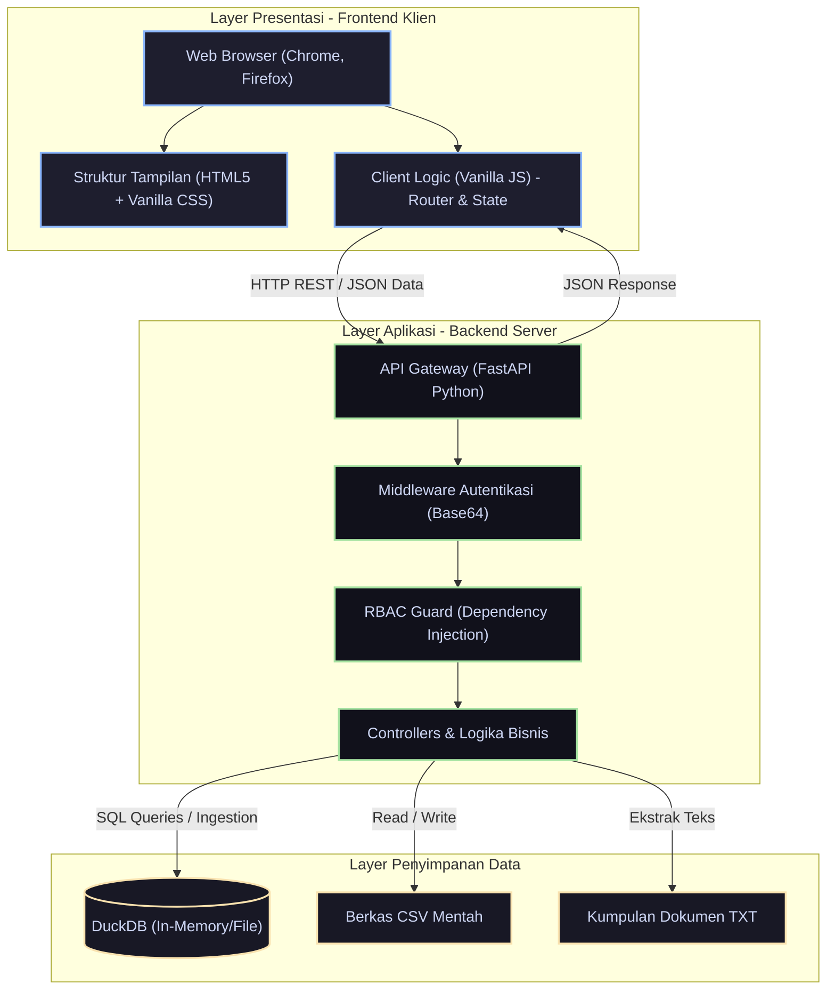
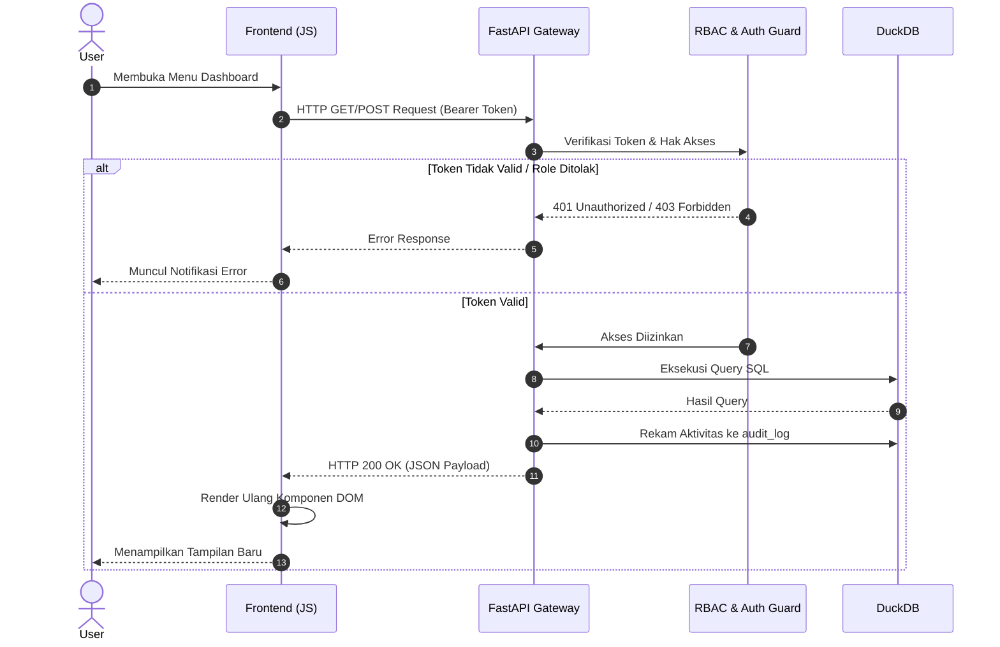
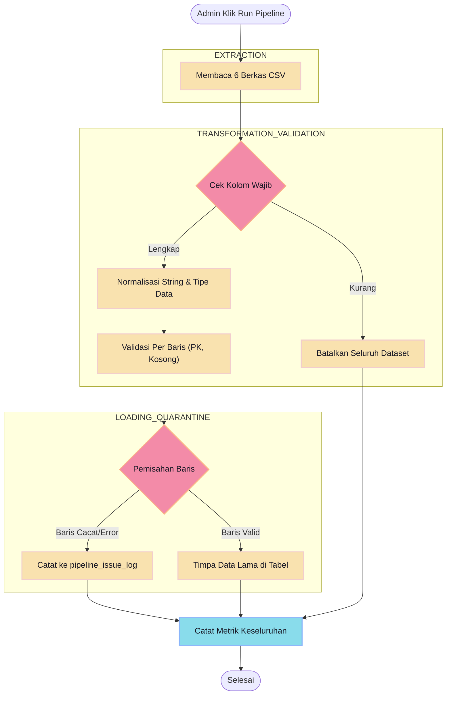
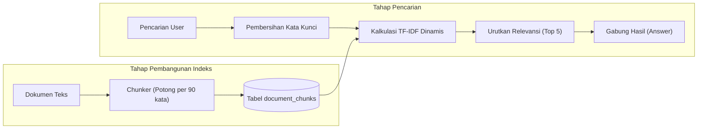
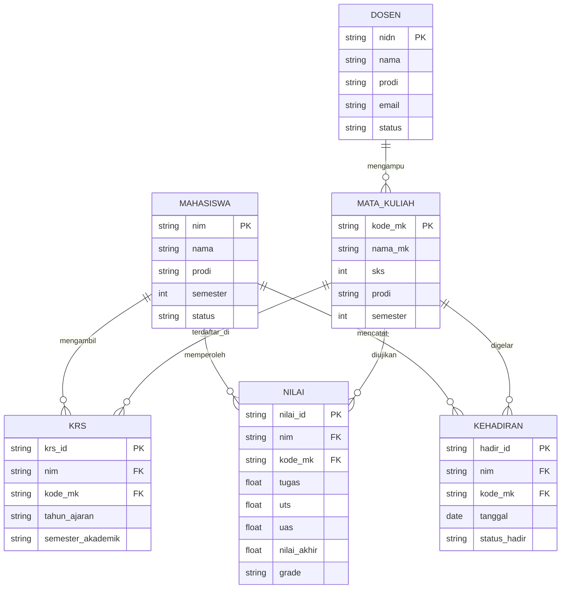
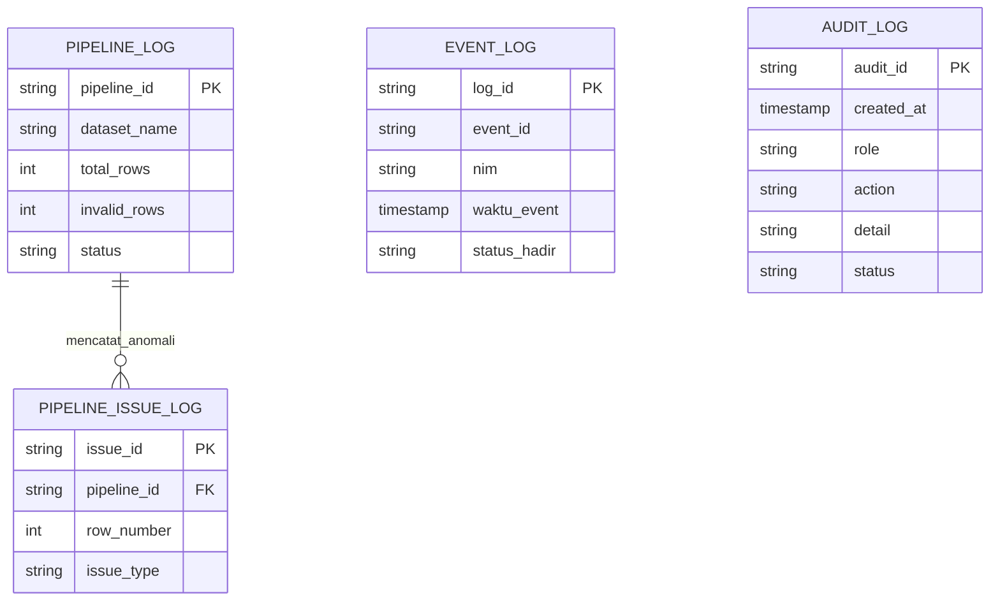

# Arsitektur & Alur Kerja Lengkap Sistem SC-DATA

Dokumen ini memuat paparan komprehensif mengenai **Arsitektur Tingkat Tinggi**, **Alur Kerja (Flows)**, **Logika Bisnis**, serta **Skema Data** dari sistem perguruan tinggi terintegrasi SC-DATA.

---

## 🏗️ 1. Arsitektur Komponen Utama (3-Tier Terperinci)

Sistem dibangun menggunakan filosofi *Edge/Local-First* di mana seluruh antarmuka, API, dan database dapat berjalan luring tanpa latensi jaringan eksternal (Internet). Tujuannya adalah menghadirkan sistem "Zero-Latency UI".

### Penjelasan Lapisan Teknologi:
1. **Frontend Layer**: Sepenuhnya dibangun dengan statis (`index.html` dan Javascript lokal) agar antarmuka instan terbuka. Tidak ada server-side rendering (SSR). Semua navigasi menu diatur lewat DOM manipulation menggunakan Javascript *vanilla*.
2. **API Layer**: Dibangun di atas **FastAPI**, sebuah kerangka kerja berbasis *Asynchronous Python*. Semua permintaan HTTP dari klien masuk ke sini. Tersedia middleware CORS dan autentikasi token (Base64 `Role:Username`).
3. **Data Layer**: Alih-alih MySQL/PostgreSQL biasa, arsitektur ini menggunakan **DuckDB** yang dikenal kencang untuk pemrosesan kolom logikal (OLAP). File tersimpan dalam bentuk file `.duckdb` yang bisa di-backup secara instan.

---

## 🔄 2. Alur Interaksi Klien-Server (Request Flow)

Bagaimana sebuah interaksi pengguna dari klik tombol hingga data kembali? Di bawah adalah urutan (*sequence*) sistematisnya.

---

## 🛠️ 3. Alur Rekayasa Data / ETL Pipeline (Data Engineering Flow)

Fitur unggulan di backend adalah **Data Pipeline** (ETL) otomatis. Berbeda dengan sekadar memasukkan data, SC-DATA memvalidasi baris data terlebih dulu, dan **menolak** data yang cacat tanpa membuat aplikasinya hancur.

**Alur Detail Pipeline:**
1. **Extraction (E)**: Sistem mengimpor file `mahasiswa.csv`, `dosen.csv`, dan kawan-kawan dari folder `data/csv`.
2. **Transformation (T)**: Membuang spasi kosong yang tidak perlu, menyamakan kapitalisasi (lowercase), lalu mengevaluasi formula (seperti mengalkulasi Nilai Akhir dari persentase Tugas + UTS + UAS otomatis).
3. **Validation & Karantina**: Jika ada NIM ganda, atau nilai kosong, baris tersebut ditolak dan di-*log* penyebabnya ke `pipeline_issue_log`. Baris lainnya yang sehat tetap lolos.
4. **Load (L)**: Baris sehat di-*insert* massal (Batch Insert) ke tabel DuckDB.

---

## 🧠 4. Alur Mesin Pencari Semantik / AI RAG (Retrieval-Augmented Generation)

Aplikasi memiliki asisten *Smart Search* tanpa API internet seperti OpenAI. Menggunakan algoritma **TF-IDF** (Term Frequency - Inverse Document Frequency) yang ditulis manual secara asali (native).

**Bagaimana ini bekerja:**
- Saat pencarian dilakukan, backend membagi kata kunci (query). 
- Ia menghitung seberapa sering setiap kata muncul dalam suatu *chunk* (Term Frequency), dan mengimbanginya dengan *Inverse Document Frequency* (mendiskon bobot kata-kata umum seperti "dan", "yang").
- *Chunk* dengan skor matematis tertinggi akan dikembalikan ke pengguna sebagai informasi paling relevan.

---

## 🗄️ 5. Skema Relasi Database Terperinci (Detailed ERD)

Skema database dipecah menjadi dua bagian utama agar lebih mudah dipahami: **Skema Akademik** (Tabel Master & Transaksi) dan **Skema Operasional** (Pencatatan Pipeline & Audit).

### A. Skema Akademik Inti
Menyimpan entitas master (Mahasiswa, Dosen, Mata Kuliah) serta interaksi akademiknya seperti Nilai, Kehadiran, dan KRS.

### B. Skema Operasional & Pipeline Log (Black-Box System)
Tabel-tabel ini tidak memiliki relasi langsung dengan tabel akademik karena berfungsi sebagai **Audit Trail** dan **Karantina ETL** berkinerja tinggi.

> [!NOTE]
> Pemisahan skema operasional dan akademik ini sangat disengaja. Jika data akademik di-reset (*Truncate*), data pada Audit Log dan Event Log tetap dipertahankan untuk kebutuhan forensik dan keamanan sistem (Standard Enterprise).
