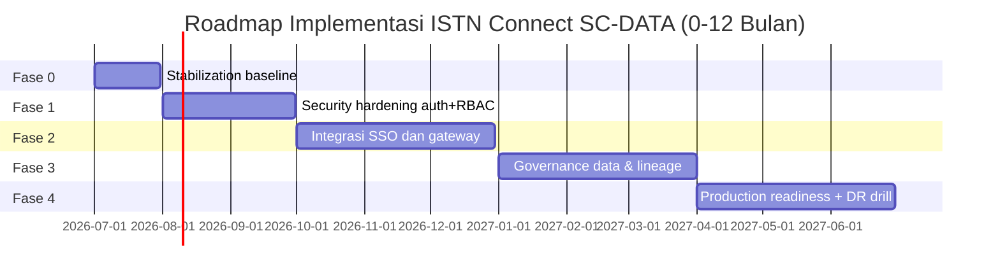

# ISTN Connect SC-DATA API DuckDB — Laporan Arsitektur Enterprise & Validasi Sistem  
**Institut Sains dan Teknologi Nasional (ISTN)**  
**Dokumen Serah Terima Teknis (Technical Handover Documentation)**

---

## 1. HEADER PROFESIONAL

### 1.1 Judul Proyek
**ISTN Connect SC-DATA API DuckDB ONE CLICK ULTRA V3**  
Platform portal akademik terpadu berbasis role (Mahasiswa, Dosen, Administrator, Pimpinan) yang mengintegrasikan:
- Frontend SPA (HTML/CSS/JavaScript)
- Backend API lokal (FastAPI)
- Engine data lokal (DuckDB)
- Data pipeline akademik terstruktur (6 dataset CSV)
- Komponen RAG (Retrieval-Augmented Generation) berbasis dokumen kebijakan akademik

### 1.2 Branding Organisasi
Dokumen ini disusun untuk lingkungan **ISTN** sebagai artefak teknis formal untuk:
- validasi arsitektur,
- validasi operasional endpoint,
- validasi kualitas QA frontend,
- serta acuan implementasi lanjutan menuju deployment institusional.

### 1.3 Deskripsi Singkat Sistem
Sistem menyediakan command center akademik end-to-end:
- autentikasi role-based,
- monitoring event presensi,
- pipeline validasi dan load data akademik,
- audit trail aktivitas,
- indexing dokumen akademik untuk pencarian cerdas,
- backup database dan export bukti operasional,
- final validation status sistem berbasis kondisi data runtime aktual.

---

## 2. EXECUTIVE SUMMARY

ISTN Connect SC-DATA API DuckDB dirancang sebagai integrasi fullstack akademik yang memadukan frontend monolitik role-aware dengan backend API modular berbasis FastAPI dan penyimpanan analitik lokal DuckDB. Arsitektur ini memungkinkan siklus data akademik berjalan dari sumber file CSV dan dokumen kebijakan hingga penyajian insight, bukti audit, dan kontrol governance dalam satu ekosistem lokal yang dapat direplikasi.

Dari sisi backend, sistem menyediakan **17 endpoint utama** yang mencakup:
- health/database proof,
- event ingestion dan reset,
- pipeline ETL-like run + logging issue,
- RAG index build dan semantic-like search (TF-IDF sederhana),
- audit log retrieval,
- export CSV evidence,
- backup DB,
- final validation checklist.

Dari sisi data, pipeline memproses 6 dataset inti (`mahasiswa`, `dosen`, `mata_kuliah`, `krs`, `nilai`, `kehadiran`) dengan validasi kolom wajib, missing value, duplicate primary key, validasi domain (skor nilai dan status hadir), serta pencatatan issue terstruktur ke `pipeline_issue_log`.

Dari sisi AI/RAG, sistem membangun `document_chunks` dari dokumen teks akademik internal (`docs/*.txt`) dan menjalankan retrieval berbasis scoring TF-IDF terhadap query pengguna melalui endpoint `/api/rag/search`.

Berdasarkan **TESTING_REPORT.md**, sistem telah melewati pengujian komprehensif dengan hasil:
- **17 endpoint diuji**
- **31 skenario diuji**
- **31 PASS, 0 FAIL**
- tidak ditemukan bug fungsional endpoint API
- backend dinyatakan siap finalisasi.

Dari sisi frontend QA, berdasarkan **VALIDATION_REPORT_V16_1_QA.txt**:
- login 4 role PASS,
- navigasi halaman per role PASS (tanpa halaman gagal),
- fitur aksi utama PASS,
- tidak ditemukan error console/page error saat pengujian QA.

Kesimpulan eksekutif: solusi berada pada status **operasional kuat untuk prototipe enterprise lokal**, dengan fondasi teknis memadai untuk ditransisikan ke implementasi institusional berbasis infrastruktur kampus/enterprise.

---

## 3. INVENTARIS ARTEFAK

> Klasifikasi artefak: Frontend, Backend, Database, Pipeline/Data, Dokumen/Validasi, Otomasi Operasional.

### 3.1 Tabel Inventaris File Inti

| Kategori | Artefak | Lokasi | Fungsi Teknis |
|---|---|---|---|
| Frontend | `index.html` | root proyek | Shell UI portal, login screen, app shell, command center, modal, toast |
| Frontend | `style.css` | root proyek | Styling UI, glassmorphism, layout dashboard, komponen visual |
| Frontend | `app.js` | root proyek | Core SPA engine, RBAC menu/pageMap, localStorage state, aksi role, integrasi API FastAPI, modul performa |
| Frontend | `features.js` | root proyek | Ekstensi/fitur frontend tambahan yang diload setelah app.js |
| Frontend | `assets/istn-logo.jpg` | `assets/` | Branding visual ISTN |
| Backend | `backend/main.py` | `backend/` | FastAPI app, routing 17 endpoint, auth bearer, event/pipeline/rag/audit/export/backup/validation |
| Backend | `backend/db.py` | `backend/` | Utility koneksi DuckDB, lock tulis, helper audit, export CSV, table count, ukuran DB |
| Backend | `backend/init_db.py` | `backend/` | DDL tabel inti, index, bootstrap schema, seed audit init |
| Backend | `backend/seed_data.py` | `backend/` | Skrip pendukung seeding data |
| Backend | `backend/one_click_demo.py` | `backend/` | Skrip demonstrasi one-click backend flow |
| Backend | `backend/requirements.txt` | `backend/` | Dependensi Python backend |
| Database | `backend/sc_data.duckdb` | `backend/` | File database operasional utama |
| Database | `backend/backups/*.duckdb` | `backend/backups/` | Snapshot backup database historis |
| Pipeline/Data | `data/mahasiswa.csv` | `data/` | Dataset master mahasiswa |
| Pipeline/Data | `data/dosen.csv` | `data/` | Dataset master dosen |
| Pipeline/Data | `data/mata_kuliah.csv` | `data/` | Dataset master mata kuliah |
| Pipeline/Data | `data/krs.csv` | `data/` | Dataset KRS |
| Pipeline/Data | `data/nilai.csv` | `data/` | Dataset nilai (tugas/UTS/UAS/grade) |
| Pipeline/Data | `data/kehadiran.csv` | `data/` | Dataset kehadiran akademik |
| Pipeline/Data | `data/kehadiran_event.csv` | `data/` | Dataset sumber event monitor presensi |
| RAG Dokumen | `docs/pedoman_krs.txt` | `docs/` | Sumber knowledge RAG kebijakan KRS |
| RAG Dokumen | `docs/pedoman_skripsi.txt` | `docs/` | Sumber knowledge RAG kebijakan skripsi |
| RAG Dokumen | `docs/aturan_cuti_akademik.txt` | `docs/` | Sumber knowledge RAG kebijakan cuti |
| RAG Dokumen | `docs/sop_perkuliahan.txt` | `docs/` | Sumber knowledge RAG SOP perkuliahan |
| Evidence | `backend/outputs/*.csv` | `backend/outputs/` | Export evidence event/pipeline/audit log |
| Validasi | `TESTING_REPORT.md` | root proyek | Rekap pengujian API 17 endpoint dan 31 skenario |
| Validasi | `VALIDATION_REPORT_V16_1_QA.txt` | root proyek | QA frontend V16.1 |
| Validasi | `VALIDATION_REPORT.txt` | root proyek | Validasi akun, role, dan localStorage state |
| Audit Arsitektur | `enterprise_audit_report.html` | root proyek | Dashboard audit enterprise interaktif |
| Operasional | `START_ONE_CLICK.bat` | root proyek | Orkestrasi startup cepat |
| Operasional | `RUN_BACKEND.bat` | root proyek | Menjalankan backend FastAPI |
| Operasional | `OPEN_FRONTEND.bat` | root proyek | Membuka frontend |
| Operasional | `OPEN_HEALTH_CHECK.bat` | root proyek | Verifikasi endpoint kesehatan |
| Operasional | `RESET_DATABASE_AND_START.bat` | root proyek | Reset DB dan start ulang |
| Operasional | `STOP_BACKEND.bat` | root proyek | Hentikan backend process |

### 3.2 Tabel Tabel Database Inti (DuckDB)

| Tabel | Peran |
|---|---|
| `event_log` | Penyimpanan event presensi yang dimuat via `/api/events/load` |
| `pipeline_log` | Log eksekusi pipeline per dataset |
| `pipeline_issue_log` | Detail issue validasi data pipeline |
| `audit_log` | Audit aktivitas sistem dan endpoint |
| `document_chunks` | Potongan dokumen hasil build index RAG |
| `mahasiswa` | Master data mahasiswa |
| `dosen` | Master data dosen |
| `mata_kuliah` | Master data mata kuliah |
| `krs` | Data KRS |
| `nilai` | Data nilai akademik |
| `kehadiran` | Data kehadiran akademik |
| `backup_log` | Catatan aktivitas backup DB |

---

## 4. ARSITEKTUR 7 LAYER

### 4.1 Definisi Layer

#### Layer 1 — Sources
Sumber data primer:
- CSV akademik (`data/*.csv`)
- Event stream simulatif (`kehadiran_event.csv`)
- Dokumen kebijakan akademik (`docs/*.txt`)
- Interaksi user dari UI role-based

#### Layer 2 — Ingestion & Interface
Komponen ingestion:
- Endpoint `/api/events/load` untuk event ingestion batch
- Endpoint `/api/pipeline/run` untuk ingest+validasi+load 6 dataset
- Endpoint `/api/rag/build` untuk ingest dokumen kebijakan

Komponen interface:
- `app.js` memanggil API via `fetch` (`apiGet`, `apiPost`) dengan bearer token lokal

#### Layer 3 — Processing & Quality Control
Mekanisme quality:
- validasi kolom wajib,
- deteksi duplicate PK,
- deteksi missing value,
- validasi domain nilai (0–100),
- validasi domain status hadir (`hadir|izin|sakit|alfa`),
- pencatatan issue ke `pipeline_issue_log`,
- pembentukan grade otomatis (`calculate_grade`).

#### Layer 4 — Storage
Storage engine:
- DuckDB lokal (`backend/sc_data.duckdb`)
- tabel transaksional/logging/audit
- backup snapshot `backend/backups/*.duckdb`
- export bukti `backend/outputs/*.csv`

#### Layer 5 — Intelligence & Analytics
Komponen analitik:
- dashboard summary (`/api/dashboard/summary`)
- event summary (`/api/events/summary`)
- pipeline log visualization (`/api/pipeline/log`)
- RAG retrieval (`/api/rag/search`, TF-IDF scoring sederhana)

#### Layer 6 — Serving & Experience
Serving layer:
- FastAPI sebagai service orchestration
- SPA frontend sebagai role-specific command UI
- endpoint export dan proof untuk artefak audit

#### Layer 7 — Governance & Assurance
Governance:
- role token validation (Bearer Base64 role:username)
- audit trail server-side (`audit_log`)
- backup endpoint (`/api/backup/create`)
- final validation endpoint (`/api/validation/final`)
- laporan QA/testing sebagai evidensi formal

### 4.2 Diagram Arsitektur 7 Layer (Mermaid)

```mermaid
flowchart TB
  subgraph L1[Layer 1 - Sources]
    S1[data/*.csv]
    S2[data/kehadiran_event.csv]
    S3[docs/*.txt]
    S4[User Actions from Frontend]
  end

  subgraph L2[Layer 2 - Ingestion & Interface]
    I1[/api/events/load]
    I2[/api/pipeline/run]
    I3[/api/rag/build]
    I4[app.js apiGet/apiPost]
  end

  subgraph L3[Layer 3 - Processing & Quality]
    P1[Schema Validation]
    P2[Missing/Duplicate Check]
    P3[Domain Validation]
    P4[Issue Logging pipeline_issue_log]
    P5[Grade Calculation]
  end

  subgraph L4[Layer 4 - Storage]
    D1[(sc_data.duckdb)]
    D2[event_log]
    D3[pipeline_log]
    D4[audit_log]
    D5[document_chunks]
    D6[master tables]
  end

  subgraph L5[Layer 5 - Intelligence & Analytics]
    A1[/api/dashboard/summary]
    A2[/api/events/summary]
    A3[/api/pipeline/log]
    A4[/api/rag/search]
  end

  subgraph L6[Layer 6 - Serving & Experience]
    X1[FastAPI Backend]
    X2[SPA Frontend RBAC]
    X3[Export CSV Endpoints]
  end

  subgraph L7[Layer 7 - Governance]
    G1[Bearer Role Validation]
    G2[Audit Trail]
    G3[Backup DB]
    G4[Final Validation]
    G5[QA & Testing Reports]
  end

  S1 --> I2
  S2 --> I1
  S3 --> I3
  S4 --> I4
  I4 --> X1
  I1 --> P1
  I2 --> P2
  I2 --> P3
  I2 --> P4
  I2 --> P5
  I3 --> P1
  P1 --> D1
  P2 --> D1
  P3 --> D1
  P4 --> D3
  P5 --> D6
  D1 --> A1
  D1 --> A2
  D1 --> A3
  D1 --> A4
  A1 --> X2
  A2 --> X2
  A3 --> X2
  A4 --> X2
  X1 --> X3
  X1 --> G1
  X1 --> G2
  X1 --> G3
  X1 --> G4
  G4 --> G5
```

---

## 5. MATRIKS VALIDASI

### 5.1 Ringkasan Validasi API (Sumber: `TESTING_REPORT.md`)

- Total endpoint utama diuji: **17**
- Total skenario diuji: **31**
- Total PASS: **31**
- Total FAIL: **0**
- Bug fungsional endpoint: **Tidak ada**
- Perubahan kode pasca testing: **Tidak ada**

### 5.2 Matriks Endpoint API (17 Endpoint)

| No | Endpoint | Metode | Status Uji |
|---|---|---|---|
| 1 | `/api/health` | GET | PASS |
| 2 | `/api/db/tables` | GET | PASS |
| 3 | `/api/dashboard/summary` | GET | PASS |
| 4 | `/api/events/load` | POST | PASS |
| 5 | `/api/events/summary` | GET | PASS |
| 6 | `/api/events/latest?limit=...` | GET | PASS |
| 7 | `/api/events/reset` | POST | PASS |
| 8 | `/api/pipeline/run` | POST | PASS |
| 9 | `/api/pipeline/log?limit=...` | GET | PASS |
| 10 | `/api/rag/build` | POST | PASS |
| 11 | `/api/rag/search` | POST | PASS |
| 12 | `/api/audit/log?limit=...` | GET | PASS |
| 13 | `/api/export/event-log` | GET | PASS |
| 14 | `/api/export/pipeline-log` | GET | PASS |
| 15 | `/api/export/audit-log` | GET | PASS |
| 16 | `/api/backup/create` | POST | PASS |
| 17 | `/api/validation/final` | GET | PASS |

### 5.3 Matriks Skenario API (31 Skenario, Rekap)

| Area Uji | Jumlah Skenario | Hasil |
|---|---:|---|
| Health & DB proof | 3 | PASS |
| Event monitor flow | 6 | PASS |
| Pipeline run + log | 6 | PASS |
| RAG build + search | 4 | PASS |
| Audit & export | 6 | PASS |
| Backup & final validation | 3 | PASS |
| Integrasi end-to-end | 3 | PASS |
| **Total** | **31** | **31 PASS / 0 FAIL** |

### 5.4 Bukti Perubahan Data DuckDB (Sebelum vs Sesudah Testing)

| Tabel | Sebelum | Sesudah | Catatan |
|---|---:|---:|---|
| `audit_log` | 1 | 7 | Bertambah seiring aktivitas endpoint |
| `backup_log` | 0 | 1 | Bertambah setelah `/api/backup/create` |
| `document_chunks` | 0 | 4 | Terisi setelah `/api/rag/build` |
| `dosen` | 0 | 6 | Terisi via pipeline |
| `event_log` | 0 | 0 | Sempat terisi lalu di-reset endpoint reset |
| `kehadiran` | 0 | 20 | Terisi via pipeline |
| `krs` | 0 | 20 | Terisi via pipeline |
| `mahasiswa` | 0 | 10 | Terisi via pipeline |
| `mata_kuliah` | 0 | 7 | Terisi via pipeline |
| `nilai` | 0 | 20 | Terisi via pipeline |
| `pipeline_issue_log` | 0 | 0 | Tidak ada issue tercatat pada sesi ini |
| `pipeline_log` | 0 | 6 | 6 dataset pipeline tercatat |

### 5.5 QA Frontend (Sumber: `VALIDATION_REPORT_V16_1_QA.txt` dan `VALIDATION_REPORT.txt`)

| Domain QA | Hasil |
|---|---|
| Syntax `app.js` (`node --check`) | PASS |
| Login role (Mahasiswa, Dosen, Administrator, Pimpinan) | PASS |
| Menu Mahasiswa (15 halaman) | PASS |
| Menu Dosen (16 halaman) | PASS |
| Menu Administrator (15 halaman) | PASS |
| Menu Pimpinan (13 halaman) | PASS |
| Fitur aksi utama (KRS, AI, RAG, compose, agenda, profil, settings, CRUD, pipeline, compliance, deployment, risk, export) | PASS |
| Data-action handler coverage | PASS (tidak ada unhandled action) |
| Console error saat QA | Tidak ada |
| Page runtime error saat QA | Tidak ada |
| Validasi akun (10 mahasiswa, 6 dosen, admin, pimpinan) | PASS |
| Validasi localStorage state V16 | PASS |

---

## 6. ROADMAP & MITIGASI RISIKO

### 6.1 Roadmap Implementasi 0–12 Bulan

| Fase | Rentang | Fokus | Deliverable |
|---|---|---|---|
| Fase 0 | 0–1 bulan | Stabilization & Hardening Lokal | Freeze baseline API/frontend, dokumentasi runbook, baseline backup policy |
| Fase 1 | 1–3 bulan | Security Enhancement | Migrasi auth token ke JWT signed, hashing password, RBAC policy formal |
| Fase 2 | 3–6 bulan | Integration Kampus | Integrasi SSO/LDAP kampus, API gateway internal, logging terpusat |
| Fase 3 | 6–9 bulan | Data Governance Expansion | Data catalog, lineage, retention policy, masking policy untuk PII akademik |
| Fase 4 | 9–12 bulan | Production Readiness | HA deployment, monitoring observability, DR drill, SLA/SLO service |

### 6.2 Diagram Roadmap (Mermaid Gantt)



### 6.3 Matriks Risiko Teknis & Mitigasi

| Risiko | Dampak | Probabilitas | Mitigasi Teknis |
|---|---|---|---|
| Auth token base64 non-signed | Tinggi | Sedang | Implement JWT signed + expiry + refresh + revocation |
| Penyimpanan password plaintext frontend seed | Tinggi | Sedang | Enforce credential vault + hash di backend + disable static creds produksi |
| Ketergantungan localStorage untuk state kritikal | Sedang | Tinggi | Migrasi state kritikal ke backend persistence + session server |
| Single-node DuckDB lokal | Sedang | Sedang | Rencana migrasi ke PostgreSQL production + backup terjadwal |
| Ketiadaan observability terpusat | Sedang | Sedang | Tambah structured logging, metrics exporter, alerting |
| RAG retrieval sederhana (TF-IDF) | Rendah-Menengah | Sedang | Tingkatkan ke vector store + embeddings + evaluation harness |
| Tidak ada rate limiting endpoint | Sedang | Sedang | Tambahkan middleware rate limit + abuse protection |
| Validasi runtime bergantung kondisi data sesi | Rendah | Tinggi | Definisikan baseline dataset test fixture untuk CI repeatability |

---

## 7. REFERENSI ARTEFAK NYATA

### 7.1 Dokumen Internal Proyek (Wajib Rujuk)

| Artefak | Lokasi | Fungsi |
|---|---|---|
| Testing Report API | `TESTING_REPORT.md` | Bukti pengujian 17 endpoint / 31 skenario |
| QA Validation Frontend | `VALIDATION_REPORT_V16_1_QA.txt` | Bukti QA role/page/action coverage |
| Validation Akun & Sistem | `VALIDATION_REPORT.txt` | Bukti akun, role, localStorage state |
| Audit Dashboard Enterprise | `enterprise_audit_report.html` | Visual audit arsitektur dan fitur |
| Dataset Akademik | `data/*.csv` | Sumber pipeline akademik |
| Dokumen RAG | `docs/*.txt` | Sumber knowledge retrieval |
| Output Evidence CSV | `backend/outputs/*.csv` | Artefak export audit/pipeline/event |
| Database Operasional | `backend/sc_data.duckdb` | Sumber data aktual seluruh endpoint |

### 7.2 Daftar Endpoint Operasional Produksi-Prototipe (Current Runtime)
Base URL backend lokal:
```text
http://127.0.0.1:8000
```

Base API:
```text
http://127.0.0.1:8000/api
```

---

## Lampiran A — Ringkasan Kesiapan Sistem

- Backend FastAPI: **RUNNING (berdasarkan report uji)**
- Koneksi DuckDB: **CONNECTED**
- API Functional Test: **31/31 PASS**
- Frontend QA: **PASS tanpa runtime error**
- Audit trail: **aktif (`audit_log`)**
- Backup mechanism: **aktif (`/api/backup/create`)**
- Export evidence: **aktif (`/api/export/*`)**
- Final validation endpoint: **aktif** dengan status bergantung kondisi runtime data

---

## Lampiran B — Catatan Transisi Menuju Enterprise Production

1. Pertahankan struktur modular backend saat ini (`main.py`, `db.py`, `init_db.py`) sebagai fondasi service decomposition.
2. Migrasikan autentikasi dari token base64 ke standar signed token + policy enforcement.
3. Migrasikan persistence utama dari localStorage frontend ke backend state service untuk data kritikal.
4. Jadikan `TESTING_REPORT.md` + `VALIDATION_REPORT_V16_1_QA.txt` sebagai baseline acceptance criteria CI/CD.
5. Formalisasi governance: data classification, retention, masking, dan audit compliance periodik.

---

**Dokumen ini disusun berdasarkan artefak aktual yang tersedia pada workspace proyek ISTN_One_Portal_SC_DATA_API_DuckDB_ONE_CLICK_ULTRA_V3 dan ditujukan sebagai dokumen teknis formal siap pakai untuk serah terima internal.**

